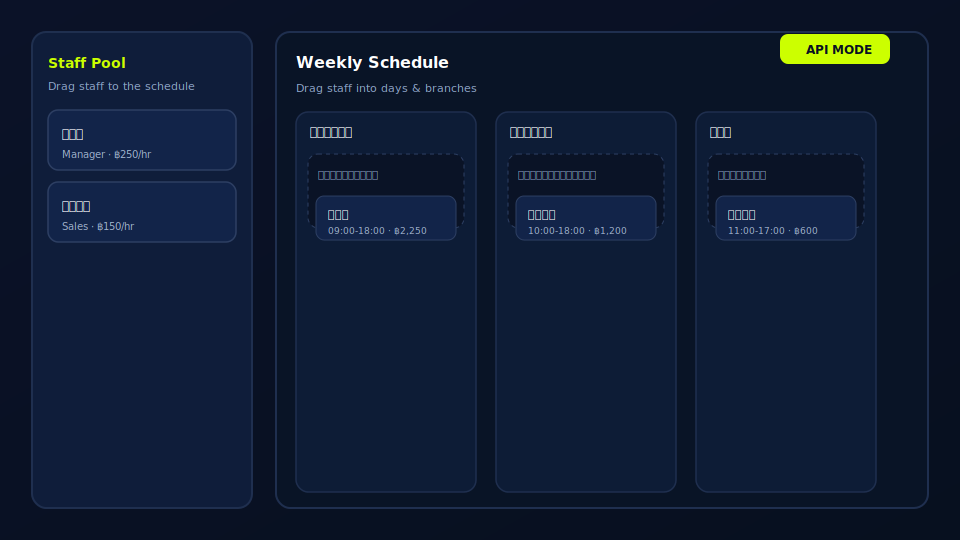

# Staff Allocation – Local Backend

Node.js + Express + SQLite backend for the single-page Staff Allocation app (staff pool + weekly schedule). Replaces the previous Firebase usage with a self-hosted REST API.



## Prerequisites
- Node.js 16+ recommended

## Setup
```bash
npm install express sqlite3 cors
node server.js
# API runs at http://localhost:3000
```

The SQLite file `database.sqlite` is created automatically in the project root on first run.

## Database Schema
- `staff_pool`: `id (text, pk)`, `name`, `role`, `default_rate`
- `allocations`: `id (text, pk)`, `staff_id (fk->staff_pool.id)`, `name`, `role`, `branch`, `day`, `start_time`, `end_time`, `rate`, `total_wage`, `created_at (default CURRENT_TIMESTAMP)`

## REST API
- `GET /api/staff` – list staff
- `POST /api/staff` – create staff `{ name, role, default_rate }`
- `GET /api/allocations[?days=7]` – list allocations, optional recent filter
- `POST /api/allocations` – create allocation `{ staff_id?, name, role, branch, day, start_time, end_time, rate, total_wage? }`
- `PUT /api/allocations/:id` – update allocation (any fields), auto recalculates `total_wage` when time/rate change
- `DELETE /api/allocations/:id` – delete allocation
- `GET /api/export-csv` – download allocations CSV (UTF-8 with BOM for Excel/Thai)

## Frontend integration (replace Firebase listeners)
```js
async function loadData() {
  const [staffRes, allocRes] = await Promise.all([
    fetch('http://localhost:3000/api/staff'),
    fetch('http://localhost:3000/api/allocations')
  ]);
  staffDirectory = await staffRes.json();
  allocations = await allocRes.json();
  renderAll();
}
loadData();
setInterval(loadData, 5000); // simple polling
```

Wire drag/drop actions:
- New allocation → `POST /api/allocations`
- Move/edit → `PUT /api/allocations/:id`
- Delete (trash) → `DELETE /api/allocations/:id`

## Notes
- CORS enabled for local HTML usage.
- `total_wage` auto-calculated when not provided (uses start/end/rate).***
