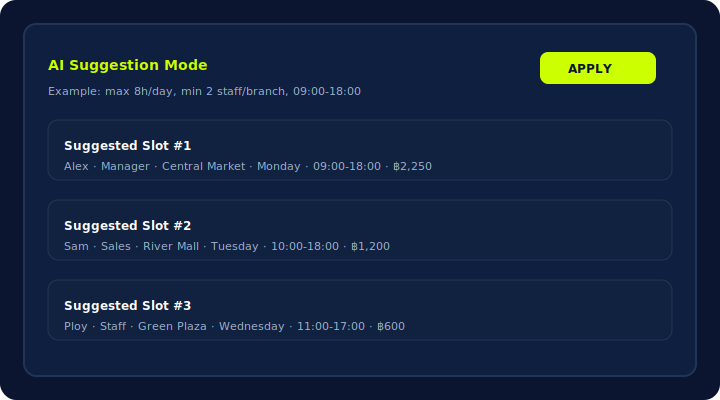

# Staff Allocation – Backend + UI

Node.js + Express + SQLite backend for a single-page Staff Allocation app (staff pool + weekly schedule). Frontend is a single HTML (Tailwind + Sortable) with modular JS and REST calls.

## Problem Statement
- Restaurants/retail teams need to assign staff by day/time/location and calculate wages per shift.
- Excel + chat leads to mistakes and poor traceability; payroll aggregation is slow.
- One-page drag-and-drop scheduler with auto wage calculation and CSV export simplifies manager + payroll workflows.




## Prerequisites
- Node.js 16+ recommended

## Setup
```bash
npm install
node server.js

# API + static UI runs at http://localhost:3000
```

The SQLite file `database.sqlite` is created automatically in the project root on first run.

Environment variables:
- `PORT` – default `3000`
- `DB_PATH` – custom SQLite location (default `./database.sqlite`)
- `RETENTION_DAYS` – auto-prune allocations older than N days (default `14`)

## Database Schema
- `staff_pool`: `id (text, pk)`, `name`, `role`, `default_rate`, `rate_unit`
- `allocations`: `id (text, pk)`, `staff_id (fk->staff_pool.id)`, `name`, `role`, `branch`, `day`, `start_time`, `end_time`, `rate`, `rate_unit`, `total_wage`, `created_at (default CURRENT_TIMESTAMP)`

## REST API
- `GET /api/staff` – list staff
- `POST /api/staff` – create staff `{ name, role, default_rate, rate_unit }`
- `PUT /api/staff/:id` – update staff
- `DELETE /api/staff/:id` – delete staff
- `GET /api/allocations[?days=7]` – list allocations, optional recent filter
- `POST /api/allocations` – create allocation `{ staff_id?, name, role, branch, day, start_time, end_time, rate, rate_unit, total_wage? }`
- `PUT /api/allocations/:id` – update allocation (any fields), auto recalculates `total_wage` when time/rate change
- `DELETE /api/allocations/:id` – delete allocation
- `GET /api/export-csv` – download allocations CSV (UTF-8 with BOM for Excel)
- `GET /api/reports/weekly[?days=7]` – aggregates (total wage, wage per branch, hours per staff)
- `POST /api/suggest/schedule` – mock AI schedule generator. Body:
  ```json
  {
    "branches": ["Central Market"],
    "days": ["Monday", "Tuesday"],
    "start_time": "09:00",
    "end_time": "18:00",
    "maxHoursPerDay": 8,
    "minStaffPerBranch": 2
  }
  ```

## Frontend (public/)
- `public/app.js` – modular JS (load/render, drag-drop, edit modal, reports tab, AI suggestion tab)
- `public/styles.css` – custom scrollbars, cards, pills
- Manual refresh button instead of polling; toast notifications; loading overlay
- Rate unit toggle (hour/day) for staff and allocations; reports tab supports last 7 / last 30 / custom days

## Features
- Staff directory with default wage rate and unit (per hour/day); drag & drop to schedule by day/branch
- Auto-calculate total wage per shift; inline edit times/rates (per-hour or per-day)
- Weekly report view: total wage, wage per branch, hours per staff; configurable range (7/30/custom days)
- CSV export for accounting/HR
- AI Suggestion Mode (mock): generate draft schedules under simple constraints, then apply to DB

## Future work / roadmap
- Authentication (roles: Admin / Manager / Staff)
- Wage reports per day/month + PDF export
- Multi-branch dashboard (chart of shifts per branch)
- Integrate Google Calendar / LINE Notify
